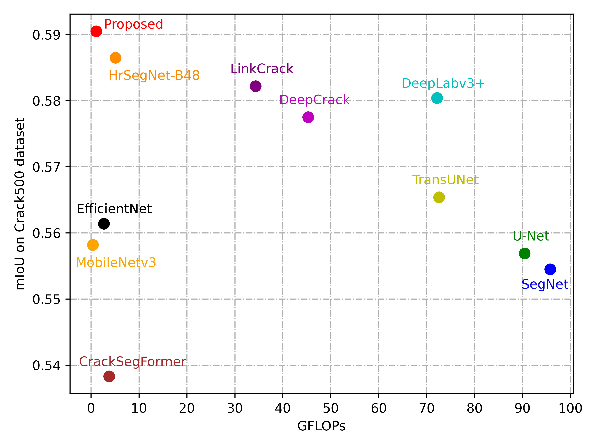
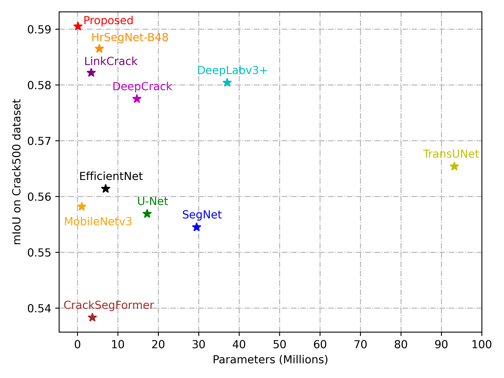

# UltraLight-CrackNet
UltraLight CrackNet: A VMamba-Based lightweight network for crack segmentation

# Abstract
Crack detection is crucial in the maintenance of civil infrastructure. The many drawbacks of traditional manual visual inspection methods have led to the continuous development of crack detection methods. However, existing crack detection techniques face the challenges of complex backgrounds and feature diversity interference, and the high computational resource requirements. This study exploits the potential of Mamba for visual tasks and proposes an UltraLight CrackNet, which consists of a parallel lightweight visual Mamba block for efficiently modelling long-distance dependencies and extracting deep semantic features, a multi-scale residual visual state space block for enhanced multi-scale feature representation, and an enhanced semantics and detail infusion module for optimising skip connections within the encoder-decoder architecture. The experimental results show that our method requires only 0.13M parameters and 1.96G FLOPs, and achieves the optimal performance on DeepCrack and Crack500 datasets with ultra-lightweight model design, with MIoU of 76.66% and 59.05%, respectively, and obtains comparable results on SteelCrack dataset, with 87.85\% reduction in parameter counts compared to the smallest comparison model.

## Visualization of comparison results on the Crack500 dataset
X-axis corresponds to the number of parameters and GFLOPs, respectively (lower the better). Y-axis represents the mIoU (higher the better)

|  |  |
|--------------------------------------|---------------------------------------|
